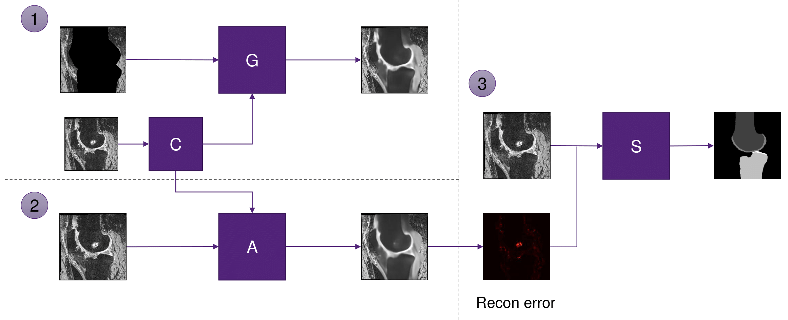

# Anomaly-Aware 3D Segmentation of Knee Magnetic Resonance Images

## Introduction
This repository contains source code and scripts for Anomaly-Aware 3D Segmentation of Knee Magnetic Resonance Images [1].

## Prerequisites
* TensorFlow (TF2) 2.x
* TensorFlow Addons 0.x
* NiBabel 3.x
* Pandas 1.x
* Seaborn 0.x

## Pipeline
\
Overall pipeline. Figure from [1].

## Networks
1. G: In Part 1, we erased regions of femur and tibia in the images and then inpainted these regions using a U-Net-based model.
2. A: In Part 2, we used the outputs from Part 1 and another U-Net-based model to replace anomalous regions in the original images with close to normal appearances.
3. S: In Part 3, the information extracted from Part 2 was used to improve the segmentation of bones and cartilages.

## Reference
[1]: Woo B, Engstrom C, Fripp J, Crozier S, Chandra SS. Anomaly-Aware 3D Segmentation of Knee Magnetic Resonance Images. \[Submitted to Medical Imaging with Deep Learning (MIDL) 2022 -- Under Review\]
